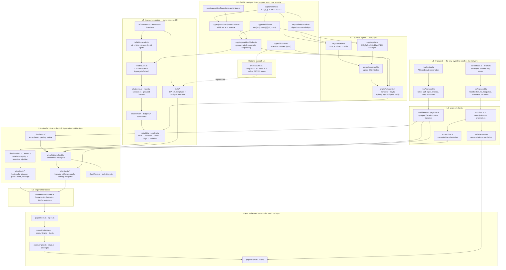
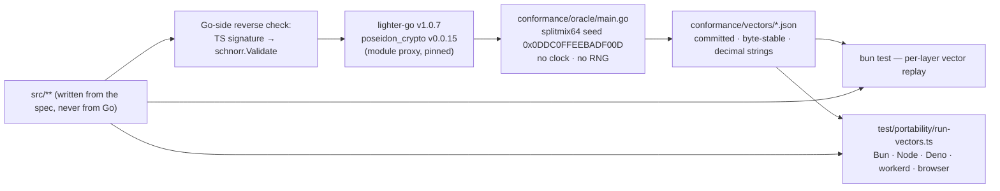
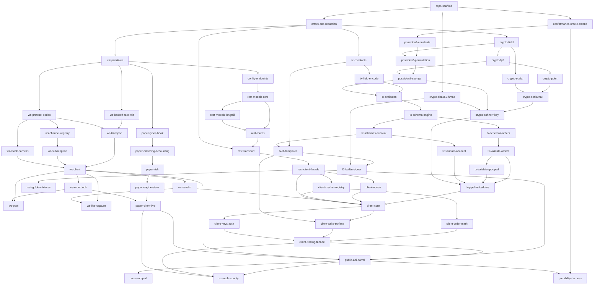

# lighter-ts — Architecture

**Repository:** `lev7finance/lighter-ts`
**Status:** authoritative design document. Every implementation issue is measured against this file plus its
named spec section in `spec/01`…`spec/08`.
**Clean-room:** this document, and everything derived from it, describes *what the protocol is*. No Go or
Python source is reproduced. Protocol-mandated constants, byte orders, field orders, endpoint paths and JSON
key names are interoperability requirements and are stated exactly.

---

## 1. Scope and goals

### 1.1 What "functional parity with lighter-go + lighter-python" means, concretely

Parity is defined by four measurable surfaces. A claim of parity is only meaningful if each is enumerated.

**(a) Cryptographic parity — bit-exact.**

| Capability | Definition of done |
|---|---|
| Goldilocks `GF(p)`, `p = 2^64 − 2^32 + 1` | every row of `conformance/vectors/goldilocks.json` reproduces exactly |
| Quintic extension `GF(p^5) = GF(p)[X]/(X^5−3)` | every row of `gfp5.json`, including `sgn0`, `legendre`, `sqrt`, `canonicalSqrt`, 40-byte codec |
| Poseidon2 over Goldilocks (plonky2 variant) | every row of `poseidon2.json`: 23 permutations, 45 `hashToQuinticExtension`, 17 `hashNoPad`, 16 `hashNToMNoPad` |
| ECgFp5 curve + scalar field mod `n` | every row of `curve.json`: 20 scalar multiples, encode/decode round trips, 11 scalar-reduction cases |
| Schnorr sign/verify | all 16 `schnorr.json` cases reproduce with the pinned nonce; all 3 negative cases reject |
| End-to-end transaction hashing + signing | all 35 `tx.json` `txHashes` rows reproduce `messageHashLeHex`, `signatureBytesHex` and `txInfoJson` byte-for-byte |
| EIP-191 L1 message construction | all 6 `tx.json` `l1Messages` rows reproduce `body`, `bodyUtf8Hex`, `eip191HashHex` |

**(b) Transaction-codec parity — 20 constructible L2 types.**
Codes 8, 9, 10, 11, 12, 13, 14, 15, 16, 17, 18, 19, 20, 28, 29, 35, 36, 41, 42, 45. For each: the ordered
Goldilocks element list, the `L2TxAttributes` aggregation, the exact JSON key set and order, the base64 /
number-array / hex encodings, and the ordered validation rules with their exact error identities.

**(c) REST parity — 78 operations across 13 groups.**
account 26, order 12, transaction 12, bridge 6, referral 6, info 5, block 3, candlestick 2, root 2,
announcement 1, funding 1, notification 1, tokenlist 1. Plus: the four endpoint profiles, the
`code`/`message` envelope with its three envelope-less exceptions, the domain error taxonomy, cursor
pagination under two field names, and the Scheme-A signed auth token.

**(d) WebSocket parity — 22 channels.**
`order_book`, `ticker`, `market_stats`, `spot_market_stats`, `trade`, `candle`, `mark_price_candle`,
`height`, `account_all`, `account_market`, `user_stats`, `account_tx`, `account_all_orders`,
`account_orders`, `account_all_trades`, `account_all_positions`, `account_all_assets`,
`account_spot_avg_entry_prices`, `pool_data`, `pool_info`, `notification`, `rfq`. Plus `jsonapi/sendtx` and
`jsonapi/sendtxbatch` over the same socket.

**(e) Client-surface parity — the example corpus.**
The Python SDK's ~63 example scripts define the acceptance surface. Each must have a TypeScript counterpart
or an explicit, linked deferral. This is what proves the SDK is *usable*, not merely *correct*.

**(f) Paper-trading parity.**
The Python-only paper client: taker-only, cross-margin, perps-only simulator over real book data, with the
exact fee tier table, position algebra, margin/health formulas, liquidation-price formula and cascade
liquidation pass reproduced to a relative tolerance of `1e-12`.

### 1.2 Goals beyond parity

1. **Replace the compiled signer.** The Python SDK ships a platform-specific Go `.so` loaded via `ctypes`;
   the monorepo has a half-finished Go-WASM stopgap at `workers/lighter-signer/`. This SDK is TypeScript all
   the way down.
2. **Run in the deployment target.** Cloudflare Workers is a first-class runtime, not an afterthought.
3. **Be correct where the references are not.** Twelve-plus enumerated defects (float decimal scaling,
   decimal-point-stripping price parsing, chain-id URL sniffing, process-global signer state, no WS
   reconnection, no order-book continuity checking, banker's-rounding slippage bounds) are fixed, each behind
   a documented, individually-bypassable flag where the fix changes bytes on the wire.

---

## 2. Non-goals

| Not doing | Why |
|---|---|
| CommonJS build | All five targets are ESM-native. Dual publishing creates the dual-package hazard, which is actively dangerous for a library whose errors are checked with type guards. `await import()` is the documented CJS answer. |
| Bundling the output | Zero runtime dependencies means there is nothing to bundle in. Per-file `tsc` emit preserves module-level tree-shaking, maps subpaths to real directories, and keeps stack traces honest. |
| Runtime schema validation (Zod/ArkType/valibot) | Adds a dependency, costs real time on order-book hot paths, and the only available schema is known-wrong — it would reject valid live responses. Types are compile-time only; an `onResponse` hook is provided for users who want their own checks. |
| Generating the client from OpenAPI as the source of truth | The vendored document marks ~95 % of response fields `required` that the server omits via `omitempty`, omits `mark_price`/`index_price` entirely, has a `"format": "uin16"` typo, and has `info.version = ""`. There is no live spec endpoint — five candidate paths all return 403. |
| Constant-time cryptography | Not achievable in portable TypeScript: BigInt allocates and its cost tracks operand magnitude. We guarantee no secret-dependent control flow, loop counts, or memory indexing, and say plainly what that does and does not buy. |
| Key memory wiping | A `bigint` cannot be zeroed. We do not claim what we cannot deliver. |
| A concurrency queue / connection pool inside the REST client | Caller's job. The `fetch` injection point covers every use case. |
| Resting-limit / maker simulation in the paper engine | The reference is taker-only, cross-margin, perps-only. Extending the model would silently change numeric output and break conformance vectors. |
| Short-Weierstrass ECgFp5 representation | Used by nothing in signing or verification; exists only for plonky2 circuit interop. Deferred until a consumer needs it. |
| `mDouble` / fixed-base comb optimisations in v1 | Pure optimisations with three code paths each; land them behind the vectors once the naive path is proven. |
| Hard-coding the asset-id → decimals table | Registry data, not protocol. Fetched from `/api/v1/assetDetails`; the table ships only as an offline fallback seed with a divergence warning. |
| An `enum` anywhere | `erasableSyntaxOnly` forbids it; `const` objects plus literal unions are used throughout. |

---

## 3. Differentiators, stated as testable properties

Each row is a CI gate, not a marketing claim.

| # | Property | How it is tested |
|---|---|---|
| D1 | **Zero runtime dependencies.** `dependencies`, `peerDependencies` and `optionalDependencies` are all empty. | `scripts/check-no-deps.ts` exits non-zero otherwise; wired into `ci.yml` `check`. |
| D2 | **No native code, no WASM, no FFI.** | No `.wasm`, `.node`, `.so`, `.dylib`, `.dll` in `files[]`; a grep gate over `src/**` for `WebAssembly`, `dlopen`, `ffi`. |
| D3 | **No Node built-ins.** The import graph of `src/**` contains zero `node:` specifiers, no `Buffer`, no `process`, no `require`. | Grep gate in CI, **plus** the workerd run with `nodejs_compat` **off** — the only test that proves it rather than asserting it. |
| D4 | **Runs unmodified on Bun 1.3, Node 20/22/24, Deno, workerd, and browsers.** | `test/portability/run-vectors.ts` — one framework-free artifact executed against the built `dist/` under all six, asserting identical vector results. |
| D5 | **No top-level side effects.** `"sideEffects": false` is truthful. | `test/portability/behaviour.ts` imports every subpath and asserts no network call, no global mutation, no timer scheduled. |
| D6 | **Synchronous signing.** `sign()` returns `Uint8Array`, never a `Promise`, on every runtime. | Type-level assertion plus a runtime `instanceof Promise` check. |
| D7 | **Tree-shakeable.** A bundle importing only `mul` from the field layer is < 2 KB gz; `./l1` is absent from a trading-only bundle; `./paper` is absent from a signing bundle. | `scripts/report-size.ts` against `size-budget.json`, failing CI on regression. |
| D8 | **Bit-exact against the Go reference.** | Every vector in `conformance/vectors/` replays green; a vector diff in a PR is a protocol change and must be reviewed as one. |
| D9 | **Strict TypeScript.** `strict`, `noUncheckedIndexedAccess`, `exactOptionalPropertyTypes`, `verbatimModuleSyntax`, `isolatedDeclarations`, `erasableSyntaxOnly`, `noPropertyAccessFromIndexSignature`. | `bun run lint` typechecks under **both** `nodenext` and `bundler` resolution. |
| D10 | **No secrets in logs or errors.** | `redact()` applied at every diagnostic boundary; a test asserts no error message or serialised error contains an auth token, `api_token`, or key material. |

---

## 4. Layered architecture



**Layer rules.**

* **L0–L2 are synchronous, pure, and perform no I/O and no clock reads** except through an injected `now()`.
  Offline signing, hardware-signer delegation and golden-vector tests are therefore trivial.
* **L3 is the only layer that touches the network.** It is defined by two small interfaces (`typeof fetch`,
  `WebSocketConstructor`) so every runtime works unmodified and tests inject fakes.
* **L5 is the only layer with mutable state** (nonce counters, metadata caches). None of it is module-scoped.
* Every layer is independently importable through the `exports` map. `"sideEffects": false`.

---

## 5. Source tree

```
lighter-ts/
├── .github/workflows/ci.yml                 CI: check · runtime matrix · workerd · examples
├── .github/workflows/publish.yml            npm publish with provenance on release
├── .github/dependabot.yml                   github-actions only (there are no npm deps)
├── package.json                             ESM-only, zero deps, explicit exports map
├── tsconfig.json                            source of truth: nodenext + max strictness
├── tsconfig.build.json                      emit: dist/, declaration + maps, stripInternal
├── tsconfig.bundler.json                    compatibility check: bundler resolution
├── tsconfig.examples.json                   typechecks examples/ against dist/
├── bunfig.toml                              bun:test config only
├── size-budget.json                         per-subpath gzipped budgets
├── LICENSE  README.md  CHANGELOG.md  CONTRIBUTING.md  SECURITY.md
│
├── conformance/
│   ├── README.md                            what each vector file pins; regeneration runbook
│   ├── oracle/main.go                       Go vector generator (pins lighter-go v1.0.7,
│   │                                        poseidon_crypto v0.0.15); never imported by src/
│   ├── oracle/go.mod  oracle/go.sum
│   └── vectors/                             checked-in JSON; the contract with the reference
│       ├── goldilocks.json  gfp5.json  poseidon2.json
│       ├── curve.json  schnorr.json  tx.json
│       └── paper/*.json                     paper-engine scenarios (Python-sourced)
│
├── scripts/
│   ├── check-no-deps.ts                     asserts the dependency objects are empty
│   ├── report-size.ts                       per-subpath gzipped size vs. budget
│   ├── gen-poseidon2-constants.ts           vectors/poseidon2.json → constants.generated.ts
│   ├── generate-models.ts                   openapi.snapshot.json → models/generated.ts
│   ├── refresh-fixtures.ts                  re-capture live REST golden fixtures
│   ├── capture-ws-fixtures.ts               live WS conformance capture (manual)
│   └── run-workerd-vectors.ts               boots wrangler dev, asserts zero failures
│
├── spec/
│   ├── openapi.snapshot.json                vendored, unversioned, known-wrong; snapshot only
│   └── README.md                            why it must never be authoritative
│
├── src/
│   ├── index.ts                             root barrel (convenience; docs lead with subpaths)
│   ├── version.ts                           SDK version constant
│   ├── errors.ts                            LighterError hierarchy + structural type guards
│   │
│   ├── util/
│   │   ├── bytes.ts                         hex, base64, LE u64 — no Buffer, no btoa
│   │   ├── json.ts                          canonical stringify; big-int-safe frame parse
│   │   ├── decimal.ts                       exact decimal ↔ bigint, rounding modes, compare
│   │   └── redact.ts                        secret redaction for logs and errors
│   │
│   ├── config/
│   │   ├── endpoints.ts                     the four profiles; chainId bound to the profile
│   │   ├── config.ts                        LighterConfig resolution, injectable fetch/WS/now
│   │   └── index.ts
│   │
│   ├── crypto/
│   │   ├── index.ts                         public crypto surface
│   │   ├── field/constants.ts               P, EPSILON, TWO_ADICITY, POWER_OF_TWO_GENERATOR, FROB1..4
│   │   ├── field/fp.ts                      GF(p): arithmetic, reduce128/reduceWide, inv, sqrt, codec
│   │   ├── field/fp5.ts                     GF(p^5): mul/square/inv/norm/legendre/sqrt/sgn0, 40-byte codec
│   │   ├── field/recode.ts                  recodeSignedDigits / recodeSigned5
│   │   ├── poseidon2/constants.generated.ts 96 external + 22 internal + 12 diagonal, digest-pinned
│   │   ├── poseidon2/permutation.ts         width 12, x^7, 4F/22P/4F, pre-round M_E
│   │   ├── poseidon2/index.ts               sponge + hashToQuinticExtension + hashNToOne
│   │   ├── scalar.ts                        Z/nZ, 40-byte LE codec (reduces, never rejects)
│   │   ├── point.ts                         ECgFp5 fractional coords, shifted group law, encode/decode
│   │   ├── scalarmul.ts                     windows, branchless lookup, [s]P, [s]G ⊕ [e]P
│   │   ├── sha256.ts                        sync SHA-256 + HMAC (nonce derivation, RFC 6979)
│   │   ├── schnorr.ts                       sign / verify
│   │   ├── nonce.ts                         hedged-deterministic / random / pinned nonce modes
│   │   └── key.ts                           ApiKey — the KeyManager equivalent
│   │
│   ├── tx/
│   │   ├── index.ts                         ./tx barrel
│   │   ├── constants.ts                     every protocol bound and tick
│   │   ├── enums.ts                         TxType 0..45 + order/TIF/grouping/margin enums
│   │   ├── brands.ts                        U8/U16/I16/U32/I64/U64 + smart constructors
│   │   ├── field-encode.ts                  BigInt.asUintN(64,·) mod p; splitU64 / splitI64Arith; gFp5 codec
│   │   ├── attributes.ts                    registry, validation, normalisation, AggregateTxHash
│   │   ├── schema.ts                        FieldSpec / TxSchema / Enc vocabulary
│   │   ├── hash.ts                          generic hasher driven by hashOrder
│   │   ├── serialize.ts                     hand-rolled JSON emitter (JSON.stringify cannot do bigint)
│   │   ├── grouped-hash.ts                  10-element leaf + left fold
│   │   ├── schemas/orders.ts                codes 14,15,16,17,28
│   │   ├── schemas/account.ts               codes 8,9,10,11,12,13,18,19,20,29,35,36,41,42,45
│   │   ├── types/orders.ts  types/account.ts
│   │   ├── validate/orders.ts  validate/grouped.ts  validate/account.ts
│   │   ├── opts.ts                          TransactOpts, expiredAt default = now + 599_000 ms
│   │   ├── build.ts                         20 pure builders
│   │   ├── pipeline.ts                      txHash / txHashHex / signTx / toTxInfo / txSubmission
│   │   └── l1/hex16.ts  templates.ts  eip191.ts  signer.ts  attach.ts  index.ts
│   │
│   ├── models/
│   │   ├── index.ts                         barrel over core + long tail + generated
│   │   ├── common.ts                        ResultCode, envelope, cursor types
│   │   ├── market.ts                        OrderBook, Perps/SpotOrderBookDetail, MarketConfig
│   │   ├── order.ts                         Order, SimpleOrder, Trade, Candle
│   │   ├── account.ts                       DetailedAccount, AccountPosition, AccountAsset
│   │   ├── transaction.ts                   Tx, EnrichedTx, RespSendTx(Batch), NextNonce, Block
│   │   ├── referral.ts  rfq.ts  lease.ts  pool.ts  misc.ts
│   │   └── generated.ts                     ~100 long-tail types, every field optional
│   │
│   ├── rest/
│   │   ├── index.ts                         ./rest barrel
│   │   ├── route-types.ts                   RouteDef, phantom-typed query/body/response
│   │   ├── routes.ts                        all 78 operations as data
│   │   ├── transport.ts                     request(): URL, auth, encoding, timeout, retry, classify
│   │   ├── client.ts                        grouped facade over routes
│   │   ├── paginate.ts                      cursor normaliser + async iterators
│   │   └── candles.ts                       single-letter candle key mapping
│   │
│   ├── ws/
│   │   ├── index.ts                         ./ws barrel
│   │   ├── backoff.ts                       full-jitter exponential + close-code classification
│   │   ├── ratelimit.ts                     token bucket + inflight semaphore
│   │   ├── protocol.ts                      envelope discrimination, channel-key codec, frame builders
│   │   ├── errors.ts                        WS error taxonomy + code → action table
│   │   ├── transport.ts                     lifecycle, keepalive, staleness watchdog, reconnect
│   │   ├── types.ts                         payload interfaces for all 22 channels
│   │   ├── channels.ts                      typed ChannelSpec registry
│   │   ├── account-assets-stream.ts         merged per-account asset snapshot
│   │   ├── subscription.ts                  AsyncIterable + callback, bounded queue, overflow policy
│   │   ├── client.ts                        LighterWsClient
│   │   ├── send-tx.ts                       correlated jsonapi/sendtx(batch)
│   │   ├── orderbook.ts                     OrderBookState + watchOrderBook
│   │   └── pool.ts                          LighterWsPool — sharding within server limits
│   │
│   ├── client/
│   │   ├── index.ts                         ./client barrel
│   │   ├── markets.ts  assets.ts  system-config.ts     metadata registry + snapshot
│   │   ├── nonce/types.ts  optimistic.ts  server.ts  manual.ts  key-pool.ts  index.ts
│   │   ├── math/book.ts  slippage.ts  quote.ts  leverage.ts  index.ts
│   │   ├── lighter-client.ts  account.ts  receipt.ts  submit.ts
│   │   ├── write/transfer.ts  withdraw.ts  account-config.ts  margin.ts
│   │   ├── write/pools.ts  staking.ts  integrator.ts  memo.ts  fast-withdraw.ts
│   │   ├── keys.ts  auth-token.ts  auth-schedule.ts
│   │   └── market-handle.ts  brackets.ts  batch.ts  sequence.ts
│   │
│   ├── paper/
│   │   ├── index.ts                         ./paper barrel
│   │   ├── types.ts                         fee tiers, enums, structures (float64 domain)
│   │   ├── book.ts                          InMemoryOrderBook: normalise, sort, snapshot, delta
│   │   ├── matching.ts                      simulateMatch + validateOrder
│   │   ├── accounting.ts                    applyFill five-case algebra, unrealised PnL, TAV
│   │   ├── risk.ts                          IMR/MMR/COMR, health, liquidation price, liquidation pass
│   │   ├── funding.ts                       opt-in funding model (off by default)
│   │   ├── engine.ts                        synchronous, I/O-free PaperEngine
│   │   ├── state.ts                         serialisable snapshot/restore (Durable Objects)
│   │   ├── client.ts                        REST/WS shell over the engine
│   │   └── live.ts                          order-book listener over the shared ws/ socket
│   │
│   └── l1-signer/                           OPTIONAL subpath — absent from trading bundles.
│       │                                    Named `l1-signer`, NOT `l1`, so it can never be
│       │                                    confused with `src/tx/l1/` (the message templates,
│       │                                    which are part of `./tx` and always ship).
│       ├── index.ts                         privateKeyL1Signer + primitives
│       ├── keccak256.ts                     Keccak-f[1600], pad 0x01 (NOT SHA-3's 0x06)
│       ├── secp256k1.ts                     ECDSA + public-key recovery
│       ├── rfc6979.ts                       deterministic k over HMAC-SHA-256
│       ├── personal-sign.ts                 EIP-191
│       └── recover.ts                       address recovery + EIP-55 checksum
│
├── test/                                    mirrors src/; bun:test
│   ├── fixtures/rest/*.json                 captured live responses (golden)
│   ├── fixtures/ws/*.json                   documented + live channel payloads
│   └── portability/run-vectors.ts  worker.ts  wrangler.jsonc  behaviour.ts
│
├── bench/                                   field, poseidon2, signer throughput
├── docs/                                    per-module documentation
├── examples/                                mirrors the Python SDK examples/ one-for-one
└── tools/gen-paper-vectors.py               Python paper-engine vector generator (not published)
```

---

## 6. Public API surface

This is the contract. Every implementation issue is measured against these declarations.

### 6.1 `package.json` exports map

```jsonc
{
  "type": "module",
  "sideEffects": false,
  "exports": {
    ".":              { "types": "./dist/index.d.ts",            "default": "./dist/index.js" },
    "./crypto":       { "types": "./dist/crypto/index.d.ts",     "default": "./dist/crypto/index.js" },
    "./tx":           { "types": "./dist/tx/index.d.ts",         "default": "./dist/tx/index.js" },
    "./rest":         { "types": "./dist/rest/index.d.ts",       "default": "./dist/rest/index.js" },
    "./ws":           { "types": "./dist/ws/index.d.ts",         "default": "./dist/ws/index.js" },
    "./client":       { "types": "./dist/client/index.d.ts",     "default": "./dist/client/index.js" },
    "./paper":        { "types": "./dist/paper/index.d.ts",      "default": "./dist/paper/index.js" },
    "./models":       { "types": "./dist/models/index.d.ts",     "default": "./dist/models/index.js" },
    "./config":       { "types": "./dist/config/index.d.ts",     "default": "./dist/config/index.js" },
    "./errors":       { "types": "./dist/errors.d.ts",           "default": "./dist/errors.js" },
    "./l1-signer":    { "types": "./dist/l1-signer/index.d.ts",  "default": "./dist/l1-signer/index.js" },
    "./package.json": "./package.json"
  },
  "dependencies": {}
}
```

No `main`, no `module`, no top-level `types`, no `require` condition.

### 6.2 `lighter-ts/errors`

```ts
export type LighterErrorKind =
  | "config" | "validation" | "math" | "signature" | "nonce"
  | "network" | "timeout" | "http" | "auth" | "blocked" | "decode" | "ws";

export declare class LighterError extends Error {
  readonly _tag: "LighterError";
  readonly kind: LighterErrorKind;
  readonly code?: string | number;
  readonly cause?: unknown;
  toJSON(): Record<string, unknown>;
}

export declare class LighterConfigError     extends LighterError {}
export declare class LighterValidationError extends LighterError {
  readonly code: LighterValidationCode;
  readonly field?: string;
  readonly txType?: number;
  readonly bound?: bigint | number;
}
export declare class LighterMathError extends LighterError {
  readonly code: "EXCESSIVE_SLIPPAGE" | "INSUFFICIENT_DEPTH" | "NO_LIQUIDITY"
              | "NOT_REPRESENTABLE" | "SCALE_INVARIANT_VIOLATED";
}
export declare class LighterSignatureError    extends LighterError {}
export declare class L1SignatureRequiredError extends LighterSignatureError {
  readonly message: string;
  readonly template: string;
  readonly txType: number;
}
export declare class LighterNonceError extends LighterError {
  readonly code: "INVALID_NONCE" | "LEASE_EXHAUSTED" | "KEY_UNKNOWN";
}
export declare class LighterTransportError extends LighterError { readonly retryable: boolean }
export declare class LighterTimeoutError   extends LighterTransportError {}
export declare class LighterApiError extends LighterError {
  readonly status: number;
  readonly code: number;
  readonly messageText: string;
  readonly shortMessage: string;
  readonly path: string;          // query string deliberately excluded — it can carry `auth`
  readonly requestId?: string;    // x-amz-cf-id
  readonly body: unknown;
}
export declare class LighterAuthError extends LighterApiError {
  readonly reason: "malformed" | "expired" | "deadline-or-signature";
}
export declare class LighterBlockedError extends LighterError { readonly rawBody: string }

export declare function isLighterError(e: unknown): e is LighterError;
export declare function isLighterApiError(e: unknown): e is LighterApiError;
export declare function isLighterAuthError(e: unknown): e is LighterAuthError;
export declare function isRetryable(e: unknown): boolean;
export declare function hasCode(e: unknown, code: number | string): boolean;

export declare const RESULT_OK: 200;
export declare const ERR_INVALID_PARAM: 20001;
export declare const ERR_INVALID_AUTH: 20013;
export declare const ERR_RESTRICTED_JURISDICTION: 20558;
export declare const ERR_ACCOUNT_NOT_FOUND: 21100;
export declare const ERR_TX_NOT_FOUND: 21500;
export declare const ERR_INVALID_MARKET_INDEX: 21602;
export declare const ERR_TIME_RANGE_EXCEEDED: 22403;
export declare const ERR_NOT_FOUND: 29404;
```

### 6.3 `lighter-ts/config`

```ts
export interface EndpointProfile {
  readonly name: string;
  readonly restBase: string;   // origin only — /api/v1 belongs to the route
  readonly wsBase: string;
  readonly chainId: number;
}

export declare const profiles: {
  readonly mainnet:           EndpointProfile;  // 304
  readonly testnet:           EndpointProfile;  // 300
  readonly robinhood:         EndpointProfile;  // 466324
  readonly robinhood_testnet: EndpointProfile;  // 300  (shares chainId with testnet — upstream fact)
};
export declare function getProfile(name: keyof typeof profiles): EndpointProfile;
export declare function defineProfile(p: EndpointProfile): EndpointProfile;

export interface LighterConfig {
  endpoint?: keyof typeof profiles | EndpointProfile;
  fetch?: typeof globalThis.fetch;
  WebSocket?: WebSocketConstructor;
  now?: () => number;
  defaultTxExpiryMs?: number;      // 599_000
  timeoutMs?: number;              // 10_000 read / 30_000 write
  retry?: { attempts?: number; baseMs?: number; capMs?: number };
  auth?: string | AuthProvider;
  onDiagnostic?: (d: Diagnostic) => void;
}
export type AuthProvider = (ctx: { accountIndex?: number; channel?: string })
  => string | Promise<string>;

export declare function resolveConfig(c?: LighterConfig): ResolvedConfig;
```

**Chain id is never inferred from a URL.** A custom `{ restBase, wsBase }` without an explicit `chainId`
throws `LighterConfigError` at construction.

### 6.4 `lighter-ts/crypto`

```ts
// ---- field ---------------------------------------------------------------
declare const FpBrand: unique symbol;
export type Fp  = bigint & { readonly [FpBrand]: never };
export type Fp5 = readonly [Fp, Fp, Fp, Fp, Fp];

export declare const P: bigint;                        // 18446744069414584321
export declare const EPSILON: bigint;                  // 4294967295
export declare const TWO_ADICITY: 32;
export declare const POWER_OF_TWO_GENERATOR: bigint;   // 7277203076849721926 — plonky2, NOT 7^((p-1)/2^32)
export declare const FP5_W: bigint;                    // 3
export declare const FP5_DTH_ROOT: bigint;             // 1041288259238279555

export declare function fpFromU64(v: bigint): Fp;
export declare function fpFromInt(v: bigint): Fp;      // proper Euclidean reduction
export declare function fpAdd(a: Fp, b: Fp): Fp;
export declare function fpSub(a: Fp, b: Fp): Fp;
export declare function fpNeg(a: Fp): Fp;
export declare function fpMul(a: Fp, b: Fp): Fp;
export declare function fpSquare(a: Fp): Fp;
export declare function fpExp(a: Fp, e: bigint): Fp;
export declare function fpExpPow2(a: Fp, n: number): Fp;
export declare function fpInverse(a: Fp): Fp;
export declare function fpInverseOrZero(a: Fp): Fp;
export declare function fpBatchInverse(xs: readonly Fp[]): Fp[];
export declare function fpIsQuadraticResidue(a: Fp): boolean;
export declare function fpSqrt(a: Fp): Fp | null;
export declare function reduce128(x: bigint): Fp;      // domain [0, 2^128)
export declare function reduceWide(x: bigint): Fp;     // domain [0, 2^192)
export declare function fpToBytes(a: Fp): Uint8Array;              // 8, LE, canonical
export declare function fpFromBytes(b: Uint8Array): Fp;            // strict
export declare function fpFromBytesUnchecked(b: Uint8Array): Fp;   // reduces

export declare function fp5Add(a: Fp5, b: Fp5): Fp5;
export declare function fp5Mul(a: Fp5, b: Fp5): Fp5;
export declare function fp5Square(a: Fp5): Fp5;
export declare function fp5InverseOrZero(a: Fp5): Fp5;
export declare function fp5Norm(a: Fp5): Fp;
export declare function fp5Legendre(a: Fp5): Fp;
export declare function fp5Frobenius(a: Fp5): Fp5;
export declare function fp5RepeatedFrobenius(a: Fp5, n: number): Fp5;
export declare function fp5Sqrt(a: Fp5): { root: Fp5; exists: boolean };
export declare function fp5CanonicalSqrt(a: Fp5): { root: Fp5; exists: boolean };
/** TRUE iff coefficient 0 is EVEN. Deliberately inverted vs. RFC 9380 — see §7 ADR-13. */
export declare function fp5Sgn0(a: Fp5): boolean;
export declare function fp5ToBytes(a: Fp5): Uint8Array;            // 40, LE, coefficient 0 first
export declare function fp5FromBytes(b: Uint8Array): Fp5;
export declare function fp5FromBytesUnchecked(b: Uint8Array): Fp5;

export declare function recodeSignedDigits(m: bigint, count: number, w: number): Int32Array;
export declare function recodeSigned5(n: bigint): Int32Array;      // 33 digits, 161-bit domain

// ---- poseidon2 -----------------------------------------------------------
export type HashOut = readonly [Fp, Fp, Fp, Fp];
export declare const WIDTH: 12; export declare const RATE: 8;
export declare const CAPACITY: 4; export declare const OUT: 4;
export declare const ROUNDS_F: 8; export declare const ROUNDS_P: 22;
export type State = [Fp,Fp,Fp,Fp,Fp,Fp,Fp,Fp,Fp,Fp,Fp,Fp];

export declare function permute(s: State): void;
export declare function hashNToM(input: readonly Fp[], m: number): Fp[];
export declare function hashNoPad(input: readonly Fp[]): HashOut;
export declare function hashTwoToOne(a: HashOut, b: HashOut): HashOut;
export declare function hashNToOne(inputs: readonly HashOut[]): HashOut;   // LEFT FOLD, not a tree
export declare function hashToQuinticExtension(input: readonly Fp[]): Fp5;
export declare const EMPTY_HASH_OUT: HashOut;

// ---- curve, scalar, signer ----------------------------------------------
export declare const N: bigint;   // group order, prime, 319 bits
export type Scalar = bigint;      // always in [0, n)
export interface CurvePoint { readonly X: Fp5; readonly Z: Fp5; readonly U: Fp5; readonly T: Fp5 }

export declare const GENERATOR: CurvePoint;
export declare const NEUTRAL: CurvePoint;
export declare function pointAdd(p: CurvePoint, q: CurvePoint): CurvePoint;     // shifted law P ⊕ Q
export declare function pointDouble(p: CurvePoint): CurvePoint;
export declare function pointNegate(p: CurvePoint): CurvePoint;
export declare function pointEquals(p: CurvePoint, q: CurvePoint): boolean;
export declare function encodePoint(p: CurvePoint): Fp5;                        // T / U = y/x
export declare function decodePoint(w: Fp5): CurvePoint | null;
export declare function mulScalar(p: CurvePoint, s: Scalar): CurvePoint;
export declare function mulGenerator(s: Scalar): CurvePoint;
export declare function mulAddG(p: CurvePoint, s: Scalar, e: Scalar): CurvePoint;

export declare function sha256(data: Uint8Array): Uint8Array;
export declare function hmacSha256(key: Uint8Array, ...msg: Uint8Array[]): Uint8Array;

export type NonceMode = "hedged" | "random";
export interface SignOptions { nonce?: NonceMode | bigint }

export declare class ApiKey {
  static fromPrivateKey(key: Uint8Array | string): ApiKey;
  static generate(): ApiKey;                       // requires crypto.getRandomValues
  readonly privateKeyBytes: Uint8Array;            // 40, LE, canonical
  readonly publicKeyBytes: Uint8Array;             // 40, LE, canonical
  readonly privateKeyHex: string;                  // 0x-prefixed lowercase, 82 chars
  readonly publicKeyHex: string;
  /** hashedMessage is 40 bytes (an Fp5 element). Returns 80 bytes. SYNCHRONOUS. */
  sign(hashedMessage: Uint8Array, opts?: SignOptions): Uint8Array;
}

/** Never throws. Malformed length, undecodable key, out-of-range scalar → false. */
export declare function verify(
  publicKey: Uint8Array, hashedMessage: Uint8Array, signature: Uint8Array,
  opts?: { allowNeutralPublicKey?: boolean },
): boolean;

export declare function publicKeyFromPrivateKey(sk: Scalar): Fp5;
export declare function signHashed(hashedMsg: Fp5, sk: Scalar, k: Scalar): { s: Scalar; e: Scalar };
```

### 6.5 `lighter-ts/tx`

```ts
export declare const TxType: {
  readonly L2ChangePubKey: 8;  readonly L2CreateSubAccount: 9;
  readonly L2CreatePublicPool: 10;  readonly L2UpdatePublicPool: 11;
  readonly L2Transfer: 12;  readonly L2Withdraw: 13;
  readonly L2CreateOrder: 14;  readonly L2CancelOrder: 15;
  readonly L2CancelAllOrders: 16;  readonly L2ModifyOrder: 17;
  readonly L2MintShares: 18;  readonly L2BurnShares: 19;
  readonly L2UpdateLeverage: 20;  readonly L2CreateGroupedOrders: 28;
  readonly L2UpdateMargin: 29;  readonly L2StakeAssets: 35;
  readonly L2UnstakeAssets: 36;  readonly L2UpdateAccountConfig: 41;
  readonly L2UpdateAccountAssetConfig: 42;  readonly L2ApproveIntegrator: 45;
  // …plus every L1 and internal code 0..45 for response decoding
};
export declare const CONSTRUCTIBLE_TX_TYPES: ReadonlySet<number>;   // size 20
export declare const CHAIN_ID: { readonly mainnet: 304; readonly testnet: 300 };

export interface TransactOpts {
  accountIndex: I64;
  apiKeyIndex: U8;
  nonce: I64;
  expiredAt?: I64;                 // default now() + 599_000 ms
  attributes?: TxAttributes;
  strict?: boolean;                // default true
}

export type UnsignedTx = /* 20-member discriminated union on `type` */ never;
export type SignedTx   = UnsignedTx & { readonly sig: Uint8Array };

// 20 pure, synchronous builders — no I/O, no clock beyond opts.expiredAt's default
export declare function buildCreateOrder(req: CreateOrderReq, opts: TransactOpts): UnsignedTx;
export declare function buildCancelOrder(req: CancelOrderReq, opts: TransactOpts): UnsignedTx;
// … 18 more

export declare function txHash(tx: UnsignedTx, chainId: number): Uint8Array;   // 40 bytes
export declare function txHashHex(tx: UnsignedTx, chainId: number): string;    // 80 lowercase hex, NO 0x
export declare function signTx<T extends UnsignedTx>(tx: T, key: ApiKey, chainId: number): T & { sig: Uint8Array };
export declare function toTxInfo(tx: SignedTx): string;                         // canonical JSON string
export declare function txSubmission(tx: SignedTx): { txType: number; txInfo: string; txHash: string };

export declare function expiryIn(d: { days?: number; hours?: number; minutes?: number }): I64;
export declare const IOC_EXPIRY: I64;                    // 0n
export declare const NO_CLIENT_ORDER_INDEX: I64;         // 0n
export declare function memoFromHex(hex: string): Uint8Array;   // 32 bytes
export declare function memoFromUtf8(s: string): Uint8Array;

// L1 message construction — zero crypto in this module
export interface EthPersonalSigner {
  signMessage(message: string): Promise<`0x${string}`>;   // 0x + 130 hex, v ∈ {27,28}
  getAddress?(): Promise<`0x${string}`>;
}
export declare function hex16(v: bigint | number): string;         // "0x" + 16 lowercase hex digits
export declare const L1_TEMPLATES: Readonly<Record<
  "changePubKey" | "transfer" | "approveIntegrator" | "createSubAccount" | "airdropAllocation",
  string>>;
export declare function l1MessageFor(tx: UnsignedTx, chainId: number): string | null;
export declare function eip191Message(text: string): Uint8Array;
export declare function requiresL1Signature(tx: UnsignedTx): boolean;
export declare function attachL1Signature<T extends UnsignedTx>(
  tx: T, signer: EthPersonalSigner, chainId: number): Promise<T & { l1Sig: `0x${string}` }>;
```

### 6.6 `lighter-ts/rest`

```ts
export interface RouteDef {
  readonly method: "GET" | "POST";
  readonly path: string;
  readonly auth: "none" | "required" | "optional";
  readonly encoding?: "form" | "json";      // POST only, default "form"
  readonly group: RestGroup;
  readonly itemsKey?: string;
  readonly query?: unknown;                 // phantom: `{} as T`
  readonly body?: unknown;                  // phantom
  readonly response: unknown;               // phantom
}
export declare const routes: Readonly<Record<string, RouteDef>>;   // exactly 78 entries

export declare function request<R extends RouteDef>(
  route: R, params?: ParamsOf<R>,
  config?: LighterConfig & { signal?: AbortSignal; raw?: boolean },
): Promise<ResponseOf<R>>;

export declare class LighterRestClient {
  constructor(config?: LighterConfig);
  readonly account:      GroupFacade<"account">;
  readonly order:        GroupFacade<"order">;
  readonly transaction:  GroupFacade<"transaction">;
  readonly bridge:       GroupFacade<"bridge">;
  readonly referral:     GroupFacade<"referral">;
  readonly info:         GroupFacade<"info">;
  readonly block:        GroupFacade<"block">;
  readonly candlestick:  GroupFacade<"candlestick">;
  readonly root:         GroupFacade<"root">;
  readonly announcement: GroupFacade<"announcement">;
  readonly funding:      GroupFacade<"funding">;
  readonly notification: GroupFacade<"notification">;
  readonly tokenlist:    GroupFacade<"tokenlist">;
}

export declare function paginate<R extends RouteDef>(
  client: LighterRestClient, route: R, params: ParamsOf<R>,
  opts?: { maxPages?: number }): AsyncGenerator<ResponseOf<R>>;
export declare function paginateItems<R extends RouteDef>(
  client: LighterRestClient, route: R, params: ParamsOf<R>,
  opts?: { maxPages?: number }): AsyncGenerator<ItemOf<R>>;

export declare function mapCandle(c: Candle): {
  time: number; open: number; high: number; low: number; close: number;
  baseVolume: number;   // wire key `v`  (LOWERCASE)
  quoteVolume: number;  // wire key `V`  (UPPERCASE) — swapping these is silent and severe
  interval: number;
};
```

### 6.7 `lighter-ts/ws`

```ts
export interface WebSocketLike {
  readonly readyState: number;
  send(data: string): void;
  close(code?: number, reason?: string): void;
  addEventListener(t: "open",    cb: () => void): void;
  addEventListener(t: "message", cb: (e: { data: unknown }) => void): void;
  addEventListener(t: "error",   cb: (e: unknown) => void): void;
  addEventListener(t: "close",   cb: (e: { code: number; reason: string }) => void): void;
}
export type WebSocketConstructor = new (url: string) => WebSocketLike;

export interface ChannelSpec<Snapshot, Update> {
  readonly family: string;      // "order_book"
  readonly key: string;         // "order_book/0"  — SLASH form, outbound
  readonly requiresAuth: boolean;
  readonly accountIndex?: number;
  readonly marketIndex?: number;
  parseSnapshot(raw: unknown): Snapshot;
  parseUpdate(raw: unknown): Update;
}
export type CandleResolution = "1m"|"5m"|"15m"|"30m"|"1h"|"4h"|"12h"|"1d";
export declare const channels: {
  orderBook(m: number):            ChannelSpec<OrderBookMessage, OrderBookMessage>;
  ticker(m: number):               ChannelSpec<TickerMessage, TickerMessage>;
  trades(m: number):               ChannelSpec<TradeMessage, TradeMessage>;
  marketStats(m: number | "all"):  ChannelSpec<MarketStatsMessage, MarketStatsMessage>;
  spotMarketStats(m: number | "all"): ChannelSpec<SpotMarketStatsMessage, SpotMarketStatsMessage>;
  candles(m: number, r: CandleResolution): ChannelSpec<CandleMessage, CandleMessage>;
  markPriceCandles(m: number, r: CandleResolution): ChannelSpec<MarkPriceCandleMessage, MarkPriceCandleMessage>;
  height():                        ChannelSpec<HeightMessage, HeightMessage>;
  accountAll(a: number):           ChannelSpec<AccountAllMessage, AccountAllMessage>;
  accountMarket(m: number, a: number): ChannelSpec<AccountMarketMessage, AccountMarketMessage>;
  accountStats(a: number):         ChannelSpec<UserStatsMessage, UserStatsMessage>;
  accountTxs(a: number):           ChannelSpec<AccountTxMessage, AccountTxMessage>;
  accountOrders(a: number):        ChannelSpec<AccountAllOrdersMessage, AccountAllOrdersMessage>;
  accountMarketOrders(m: number, a: number): ChannelSpec<AccountOrdersMessage, AccountOrdersMessage>;
  accountTrades(a: number):        ChannelSpec<AccountAllTradesSnapshot, AccountAllTradesUpdate>;
  accountPositions(a: number):     ChannelSpec<AccountAllPositionsMessage, AccountAllPositionsMessage>;
  accountAssets(a: number):        ChannelSpec<AccountAssetsMessage, AccountAssetsMessage>;
  accountSpotAvgEntry(a: number):  ChannelSpec<SpotAvgEntryMessage, SpotAvgEntryMessage>;
  poolData(a: number):             ChannelSpec<PoolDataMessage, PoolDataMessage>;
  poolInfo(a: number):             ChannelSpec<PoolInfoMessage, PoolInfoMessage>;
  notifications(a: number):        ChannelSpec<NotificationMessage, NotificationMessage>;
  rfq():                           ChannelSpec<RfqMessage, RfqMessage>;
};

export type OverflowPolicy = "drop-oldest" | "drop-newest" | "coalesce" | "resubscribe" | "error";
export type ChannelEvent<S, U> =
  | { kind: "snapshot"; data: S; raw: unknown; receivedAt: number }
  | { kind: "update";   data: U; raw: unknown; receivedAt: number }
  | { kind: "reset";    reason: "reconnect"|"gap"|"crossed"|"auth-refresh"|"resubscribe" }
  | { kind: "error";    code: number; message: string; fatal: boolean };

export interface Subscription<S, U> extends AsyncIterable<ChannelEvent<S, U>>, Disposable {
  readonly key: string;
  readonly state: "pending" | "active" | "closed";
  snapshot(): Promise<S>;
  on(cb: (e: ChannelEvent<S, U>) => void): () => void;
  close(): Promise<void>;
}

export declare class LighterWsClient {
  constructor(options?: LighterWsOptions);
  readonly state: "idle"|"connecting"|"handshaking"|"open"|"reconnecting"|"closed";
  readonly url: string;
  connect(): Promise<void>;
  close(code?: number, reason?: string): Promise<void>;
  subscribe<S, U>(spec: ChannelSpec<S, U>, opts?: SubscribeOptions): Subscription<S, U>;
  sendTx(txType: number, txInfo: object, opts?: { id?: string; timeoutMs?: number }):
    Promise<{ txHash: string; ack: Promise<SendTxAck> }>;
  sendTxBatch(txTypes: number[], txInfos: object[], opts?: { id?: string; timeoutMs?: number }):
    Promise<{ txHashes: string[]; ack: Promise<SendTxBatchAck> }>;
  on(event: "open"|"close"|"reconnect"|"error"|"diagnostic", cb: (e: never) => void): () => void;
}

export declare class LighterWsPool { /* shards across sockets within the 500/500/255 limits */ }

export declare class OrderBookState {
  readonly marketIndex: number;
  readonly status: "empty" | "synced" | "stale";
  readonly nonce: bigint;
  get bids(): readonly OrderBookLevel[];   // descending
  get asks(): readonly OrderBookLevel[];   // ascending
  bestBid(): OrderBookLevel | undefined;
  bestAsk(): OrderBookLevel | undefined;
  midScaled(): bigint | undefined;
  depth(side: "bid"|"ask", limitPriceScaled: bigint): bigint;
  vwap(side: "bid"|"ask", baseSizeScaled: bigint): bigint | undefined;
  applySnapshot(msg: OrderBookMessage): void;
  applyUpdate(msg: OrderBookMessage): ApplyResult;
}
export declare function watchOrderBook(
  client: WsSubscriber, marketIndex: number, options?: OrderBookWatcherOptions): OrderBookWatcher;
```

### 6.8 `lighter-ts/client`

```ts
export declare class LighterClient {
  /** Synchronous. No network, no promises. Safe at Worker module scope. */
  constructor(config?: LighterConfig & { markets?: MarketRegistry });
  static connect(config?: LighterConfig): Promise<LighterClient>;   // constructs + loads metadata
  readonly rest: LighterRestClient;
  readonly ws: LighterWsClient;
  readonly markets: MarketRegistry;
  readonly chainId: number;
  account(opts: {
    accountIndex: bigint | number;
    keys: Record<number, string | Uint8Array>;    // apiKeyIndex → private key
    nonces?: "optimistic" | "server" | "manual" | NonceSource;
    l1Signer?: EthPersonalSigner;
    integrator?: { accountIndex: bigint; takerFee?: number; makerFee?: number };
    submit?: "http" | "ws";
  }): LighterAccount;
  [Symbol.asyncDispose](): Promise<void>;
}

export declare class MarketRegistry {
  static fromSnapshot(json: MarketSnapshot): MarketRegistry;   // sync, zero I/O
  toSnapshot(): MarketSnapshot;
  load(opts?: { force?: boolean }): Promise<void>;
  get(idOrSymbol: number | string): MarketInfo;                // throws on miss — never guesses
  asset(idOrSymbol: number | string): AssetInfo;
}

export interface NonceLease extends Disposable {
  readonly apiKeyIndex: number;
  readonly nonce: bigint;
  commit(): void; rollback(): void; release(): void;
}
export interface NonceSource {
  lease(preferKey?: number): Promise<NonceLease>;
  resync(apiKeyIndex: number): Promise<void>;
  snapshot(): NonceSnapshot;
}

export declare class LighterAccount {
  readonly accountIndex: bigint;
  readonly tx: RawTxSurface;                  // 20 builders, bigint protocol units, synchronous
  market(idOrSymbol: number | string): MarketHandle;
  send(prepared: UnsignedTx | SignedTx): Promise<TxReceipt>;
  prepare(tx: UnsignedTx): Promise<SignedTx>;
  submitWithL1Signature(tx: UnsignedTx, sig: `0x${string}`): Promise<TxReceipt>;
  batch(fn: (b: BatchContext) => Promise<void> | void): Promise<TxReceipt[]>;
  sequence<T>(fn: (s: SequenceContext) => Promise<T>): Promise<T>;
  via(channel: "http" | "ws"): LighterAccount;
  // value movement & config
  transfer(o: TransferOpts): Promise<TxReceipt>;
  withdraw(o: WithdrawOpts): Promise<TxReceipt>;
  withdrawFast(o: FastWithdrawOpts): Promise<TxReceipt>;
  createSubAccount(): Promise<TxReceipt>;
  setAccountTradingMode(mode: "simple" | "uta"): Promise<TxReceipt>;
  setAssetMarginMode(asset: string | number, enabled: boolean): Promise<TxReceipt>;
  cancelAllMarkets(): Promise<TxReceipt>;
  scheduleCancelAll(timestampMs: bigint): Promise<TxReceipt>;
  abortScheduledCancelAll(): Promise<TxReceipt>;
  // pools, staking, integrator
  createPublicPool(o: CreatePoolOpts): Promise<TxReceipt & { wait(): Promise<{ poolAccountIndex: bigint }> }>;
  updatePublicPool(o: UpdatePoolOpts): Promise<TxReceipt>;
  mintShares(o: SharesOpts): Promise<TxReceipt>;
  burnShares(o: SharesOpts): Promise<TxReceipt>;
  stake(o: StakeOpts): Promise<TxReceipt>;
  unstake(o: StakeOpts): Promise<TxReceipt>;
  approveIntegrator(o: ApproveIntegratorOpts): Promise<TxReceipt>;
  revokeIntegrator(integratorAccountIndex: bigint): Promise<TxReceipt>;
  // keys and auth
  verifyKeys(): Promise<void>;
  changeApiKey(o: ChangeApiKeyOpts): Promise<TxReceipt>;
  createAuthToken(o?: { expirySeconds?: number; timestamp?: number; apiKeyIndex?: number }): string;
  [Symbol.asyncDispose](): Promise<void>;
}

export declare class MarketHandle {
  buy(o: { size?: string; notional?: string; maxSlippage?: string; checkDepth?: boolean;
           reduceOnly?: boolean; dryRun?: boolean }): Promise<AppliedReceipt>;
  sell(o: SameAsBuy): Promise<AppliedReceipt>;
  limit(o: { side: "buy"|"sell"; size: string; price: string;
             timeInForce?: "IOC"|"GTT"|"PostOnly"; clientOrderId?: bigint;
             expiry?: bigint; reduceOnly?: boolean }): Promise<AppliedReceipt>;
  postOnly(o: LimitOpts): Promise<AppliedReceipt>;
  modify(o: { orderId: bigint; size?: string; price?: string; trigger?: string }): Promise<AppliedReceipt>;
  cancel(orderId: bigint): Promise<AppliedReceipt>;
  cancelAll(): Promise<AppliedReceipt>;
  setLeverage(o: { leverage?: number; initialMarginFraction?: number; marginMode: "cross"|"isolated" }):
    Promise<AppliedReceipt & { imf: number; effectiveLeverage: number }>;
  addMargin(usdc: string): Promise<AppliedReceipt>;
  removeMargin(usdc: string): Promise<AppliedReceipt>;
  takeProfit(o: TriggerOpts): Promise<AppliedReceipt>;
  stopLoss(o: TriggerOpts): Promise<AppliedReceipt>;
  bracket(o: { entry: EntryOpts; takeProfit: TriggerOpts; stopLoss: TriggerOpts }): Promise<AppliedReceipt>;
  positionBracket(o: { takeProfit: TriggerOpts; stopLoss: TriggerOpts }): Promise<AppliedReceipt>;
}

export interface TxReceipt {
  txHash: `0x${string}`; txType: number; txInfo: string;
  nonce: bigint; apiKeyIndex: number;
  predictedExecutionTimeMs: number; volumeQuotaRemaining: bigint;
  wait(opts?: { timeoutMs?: number; signal?: AbortSignal }): Promise<TxResult>;
}
/** Every human-tier call reports the exact integers it used. Conversions are never invisible. */
export type AppliedReceipt = TxReceipt & {
  applied: { baseAmount: bigint; price: bigint; triggerPrice: bigint; orderExpiry: bigint };
};

// Pure order math, exported so users can build their own execution logic
export declare function bestPrice(book: BookSnapshot, isAsk: boolean): bigint;
export declare function potentialExecutionPrice(book: BookSnapshot, amount: bigint,
  isAsk: boolean, amountIsBase: boolean): { avgPriceNum: bigint; avgPriceDen: bigint; filled: bigint };
export declare function slippageBound(idealPrice: bigint, slippage: string, isAsk: boolean,
  mode?: "conservative" | "aggressive"): bigint;
export declare function quoteToBase(book: BookSnapshot, market: MarketInfo, quote: string,
  isAsk: boolean, maxSlippage: string): { baseAmount: bigint; price: bigint; avgPrice: bigint };
export declare function leverageToImf(leverage: number, market: MarketInfo):
  { imf: number; effectiveLeverage: number };
export declare function generateAuthTokenSchedule(o: { account: LighterAccount; days: number;
  apiKeyIndex?: number }): Record<number, Record<number, string>>;
```

### 6.9 `lighter-ts/paper` and `lighter-ts/l1-signer`

```ts
// ./paper
export declare function createPaperEngine(opts: PaperEngineOptions): PaperEngine;
export interface PaperEngine {
  setMarketConfig(c: MarketConfig): void;
  applySnapshot(marketId: number, payload: BookPayload): void;
  applyDelta(marketId: number, payload: BookPayload): void;
  placeOrder(req: PaperOrderRequest): PaperOrderResult;      // SYNCHRONOUS, no locks
  applyFunding(marketId: number, rate: number): void;         // opt-in, default off
  getHealth(): PaperAccountHealth;
  getLiquidationPrice(marketId: number): number;
  getPosition(marketId: number): PaperPosition | null;        // a copy
  getAccount(): PaperAccount;                                 // a deep copy
  getPortfolioValue(): number;
  snapshotState(): PaperEngineState;
  restoreState(s: PaperEngineState): void;
  on(event: "liquidation" | "desync" | "funding", cb: (e: never) => void): () => void;
}
export declare class PaperClient { /* REST/WS shell over PaperEngine */ }

// ./l1-signer  — optional, absent from trading bundles.
// The EIP-191 *message templates* and the EthPersonalSigner *interface* live in ./tx
// (src/tx/l1/) and always ship; only the secp256k1/keccak implementation is here.
export declare function privateKeyL1Signer(hexPrivateKey: string): EthPersonalSigner;
export declare function keccak256(data: Uint8Array): Uint8Array;
export declare function ecrecover(digest: Uint8Array, sig65: Uint8Array): Uint8Array;
export declare function recoverAddress(digest: Uint8Array, sig65: Uint8Array): `0x${string}`;
```

---

## 7. Architecture Decision Records

### ADR-1 — Field elements are canonical `bigint`, not Montgomery, not limbs, not typed arrays

**Decision.** A `GF(p)` element is a `bigint` held in fully-reduced canonical range `[0, p)`, plain (non-Montgomery)
domain, branded `Fp`. `GF(p^5)` is `readonly [Fp, Fp, Fp, Fp, Fp]`.

**Rationale.** The Go reference stores a bare `uint64` where *every* `uint64` is a legal element (`2p > 2^64`, so one
conditional subtraction canonicalises). That is a 64-bit-hardware trick with no BigInt analogue: emulating wraparound
costs a `BigInt.asUintN(64, ·)` per operation, strictly more work than the single conditional subtraction that
canonicalisation needs. Canonical-only is provably observationally identical, because every point where a
non-canonical value could escape (bytes, equality, `isZero`, `sgn0`) canonicalises first in the reference, and every
downstream precondition is *weaker* under canonical inputs. It also deletes an entire class of comparison bugs.

**Rejected.** (a) Montgomery form — pays off only when reduction needs division; Goldilocks reduction is
shifts/masks/adds, so Montgomery adds conversions at every wire boundary for zero benefit. (b) Two 32-bit `Number`
limbs — a 64×64→128 multiply then needs 16-bit sub-limbs to stay under 2^53, i.e. 16 partial products plus carry
plumbing per field multiply, ~5× the code, and it lost on every engine measured. (c) `BigUint64Array` — reading an
element allocates a fresh BigInt anyway and forces wraparound semantics back on us. A benchmark gate exists to
falsify this decision early: if the 60k-`fpMul` proxy exceeds 50 ms, prototype the limb backend behind the same brand.

### ADR-2 — Reduce with a compare-and-subtract chain in `GF(p)`, but with plain `%` inside Poseidon2

**Decision.** `reduce128` uses the Goldilocks fold (`lo + hl·(2^32−1) − hh`) with at most three conditional fixups.
The Poseidon2 permutation uses plain `% P` with a documented deferred-reduction bound argument, and **does not**
hand-roll the hi/lo split.

**Rationale.** These look contradictory and are not. In `reduce128` the input is already a single `bigint` product and
the fold replaces a BigInt division with three compares — measured 4–8× faster. Inside the permutation the operand is
a small sum of ≤ 2^70 values; there, each shift/mask/compare *allocates a new BigInt* whereas `%` on a ≤128-bit value
is one engine intrinsic. Measured: naive `%` 27.5k perm/s, deferred-reduction `%` 31.3k, hand-rolled hi/lo 14.1k on
Node — the hand-rolled version is 2–3× **slower**. This is the opposite of the intuition a reader of the Go source
gets, so it is recorded here to pre-empt the "helpful optimisation" review comment.

**Rejected.** Uniform strategy in both places. Measurement beats symmetry.

### ADR-3 — Zero runtime dependencies, enforced

**Decision.** `dependencies`, `peerDependencies` and `optionalDependencies` are empty and CI fails if they are not.
Everything is built on `globalThis.fetch`, `WebSocket`, `URL`, `URLSearchParams`, `AbortSignal.timeout/any`,
`crypto.getRandomValues`, `crypto.subtle` (optional, never on a required path), `BigInt`, `TextEncoder`, `Uint8Array`,
`DataView`.

**Rationale.** It is the product. It also sidesteps a concrete pain the consuming monorepo documents: `bunfig.toml`
pins `linker = "hoisted"` because nested duplicate `viem` copies produce mutually incompatible types. A zero-dep
library cannot participate in that failure mode. Four devDependencies (`typescript`, `@types/node`,
`@cloudflare/workers-types`, `wrangler`) are the entire tooling surface.

**Rejected.** (a) `@noble/hashes` / `@noble/curves` — excellent libraries, but taking them makes the pitch a lie and
they do not implement Goldilocks, `GF(p^5)`, ECgFp5, or Poseidon2 anyway, so we would still hand-write 80 % of the
crypto. `@noble/secp256k1` is used as a **devDependency in tests only**, to cross-check our optional L1 signer.
(b) `ws` for Node 20 — Node 20 users inject a constructor; that is a consumer-side devDependency, not ours.

### ADR-4 — ESM-only, `tsc`-emitted, per-file, with an explicit exports map

**Decision.** `"type": "module"`, `"sideEffects": false`, explicit `exports` map with 11 subpaths, no `main`/`module`/
`types`, no `require` condition, no bundler, `tsc -p tsconfig.build.json` emits `.js` + `.d.ts` + both map kinds, and
`src/` ships in `files[]`.

**Rationale.** All five targets are ESM-native. Dual publishing creates the dual-package hazard — two copies of every
error class, so `instanceof` silently fails across the boundary. That is actively dangerous for a library whose
public error-handling story is type guards (which is also why the guards are *structural*, keyed on a `_tag` string,
not `instanceof`). Not bundling preserves module-level tree-shaking granularity for the consumer's bundler, maps
subpaths to real directories, and keeps stack traces pointing at real files. `bun build` cannot emit `.d.ts`, so `tsc`
would be needed regardless.

**Rejected.** tsup/tsdown/rollup — a bundler's core value is bundling dependencies, of which there are none.

### ADR-5 — `moduleResolution: "nodenext"`, deviating from the house `bundler`

**Decision.** `tsconfig.json` uses `nodenext`; a second `tsconfig.bundler.json` typechecks under `bundler` in the same
`lint` script.

**Rationale.** Every existing tsconfig in the consuming monorepo is for an *application* with `noEmit: true`, consumed
by a bundler. Those never publish `.js`, so extensionless relative imports are harmless. `lighter-ts` is the first
published library in the org: its emitted `.js` is loaded directly by Node's ESM loader and by Deno, both of which
require fully-specified specifiers. `bundler` resolution *permits* extensionless imports, so it would let us author
code that typechecks perfectly and fails at runtime on two of five targets. `nodenext` rejects the mistake at
authoring time and additionally validates the `exports` map. The second config proves we did not accidentally depend
on nodenext-only behaviour.

**Rejected.** Matching the house convention exactly. The house convention is correct for applications and wrong for a
published library; the deviation is documented in `CONTRIBUTING.md` along with the mandatory `.js` extension rule.

### ADR-6 — REST types: hand-authored route table + hand-authored core models + generated long tail

**Decision.** One declarative `routes` table (78 entries) carrying phantom-typed `query`/`body`/`response`, ~40
hand-authored trading models with correct optionality, and ~100 long-tail models generated from a vendored OpenAPI
snapshot **with `required` ignored entirely**. No generator in the build path.

**Rationale.** The only machine-readable source is provably wrong in a way that matters: it marks ~95 % of response
fields `required` while the Go server uses `omitempty`, so a live `Trade` omitted 13 spec-required fields; and it omits
`mark_price` and `index_price`, which are the basis of liquidation and funding. A generator faithfully reproduces both
errors, producing a type layer that *lies* — `trade.taker_fee` typed `number`, `undefined` at runtime, which is exactly
the bug `strictNullChecks` exists to prevent. There is also no live spec endpoint to regenerate from: five candidate
paths all return 403, and `info.version` is `""` so drift is undetectable. Hand-authoring the ~40 models that matter,
and force-optionalising the rest, is under 1600 LOC total versus ~15k emitted by the Python generator.

Auth requirement is **hand-maintained data on each route** and must never be re-derived from the document: runtime
enforcement diverges on at least six operations, most notably `trades`, which is declared optional and enforced.

**Rejected.** (a) `openapi-typescript` plus plugin config — needs a devDependency and workarounds for defects it was
not built to work around; a ~200-line bespoke script is smaller and does exactly what is needed. (b) Fetching the spec
at build time — not an available strategy.

### ADR-7 — WebSocket API: typed channel registry, one `Subscription` serving both consumption styles

**Decision.** Channels are values (`channels.orderBook(0)`), not strings, so the received type is derived from the
subscription. A `Subscription<S, U>` is simultaneously an `AsyncIterable` and a callback target over one bounded
buffer, with per-channel-class overflow policies. `ChannelSpec` is generic over two type parameters so
`account_all_trades` (flat array snapshot, market-keyed map update) is expressible rather than papered over.

**Rationale.** An `AsyncIterable` gives natural backpressure and `for await` ergonomics but cannot express "give me
the latest, drop the rest"; a callback gives push semantics with no backpressure. Shipping one and telling users to
adapt is the mistake most exchange SDKs make. Callbacks are pushed *before* enqueueing, so a callback consumer is
never subject to the overflow policy. Overflow defaults are per channel class because the semantics genuinely differ:
`order_book` must `resubscribe` (a dropped delta breaks the nonce chain), full-state channels `coalesce`, append-only
histories `drop-oldest` — and dropped counts are always surfaced, so silent data loss is impossible.

Routing must never depend on exact string equality of the inbound `channel`, because outbound keys use slashes,
inbound echoes use colons, `account_market` echoes slashes anyway, and `account_orders` omits the account index
entirely. A five-step ladder (normalise → exact → reconstruct-from-body → unique-family → drop with a diagnostic)
handles all of it, and an unrecognised frame is *never* thrown — the reference client throws and kills its own read
loop.

**Rejected.** (a) An EventEmitter-only API. (b) One `ChannelSpec<T>` type parameter. (c) A separate WS client per
market — the reference paper client does this and burns the 255-connections-per-IP budget at 255 markets.

### ADR-8 — One error hierarchy, structural guards, typed codes, never tuples

**Decision.** A single `LighterError` base with a `kind` discriminant and a `_tag` brand, sub-classed per domain, with
`isLighterError`-style **structural** guards. Domain codes are `number` plus named constants, never a closed union.
Result-style `try*` variants wrap the same errors.

**Rationale.** The references return `(tx, response, errorString)` tuples (Python) and OpenAPI-generator exception
boilerplate where `NotFoundException` can never fire (not-found is HTTP 400 with `code: 29404`). Both are unactionable.
Structural guards are required because `instanceof` breaks across bundler and realm boundaries — the same reason we
refuse a CJS build. The code list is open and server-controlled, so a closed union would break the moment the server
adds a code.

Two classification rules are load-bearing and easy to get backwards:
1. **Success is HTTP-status-first.** Three endpoints (`withdrawalDelay`, `executeStats`, `referral/points`) return 200
   with **no `code` field at all**. The predicate is: 2xx **and** (`code` absent **or** `code === 200`). The Go
   reference checks `code` first and misclassifies all three.
2. **A non-2xx body is never assumed to be JSON.** CloudFront returns HTML with HTTP 403 on some paths from datacenter
   IPs. `JSON.parse` must never be allowed to throw a raw `SyntaxError` at a caller.

**Rejected.** Per-status exception classes; `instanceof`-based guards; string error returns.

### ADR-9 — L1/secp256k1 signing is injected by default, built-in behind `./l1-signer`

**Decision.** The core defines `EthPersonalSigner { signMessage(message: string): Promise<0x…> }`. The SDK owns
building the **exact message string** (the part that is easy to get wrong and is vector-pinned) and owns none of the
secp256k1 on the default path. A pure-TypeScript `keccak256` + secp256k1 + RFC-6979 implementation ships behind the
`./l1-signer` subpath for users who genuinely hold an L1 key. Note the naming: `src/tx/l1/` holds the message
templates and the `EthPersonalSigner` *interface* and always ships as part of `./tx`; `src/l1-signer/` holds the
secp256k1/keccak *implementation* and is a separate opt-in subpath. `00-verified-facts.md` recommends against
building the latter at all — it therefore ships **last** (wave 5) and is the one unit that may be cut without
affecting parity for the ~90 % of users who never need an L1 signature.

**Rationale.** Only three of twenty transaction types need an L1 signature (`ChangePubKey` always; `Transfer` when
cross-owner; `ApproveIntegrator` only for a third-party integrator charging non-zero fees). Roughly 90 % of users —
traders — never touch any of them. Requiring an Ethereum library for that flow would be wrong, and vendoring one would
break ADR-3. The interface is satisfied verbatim by viem's `WalletClient.signMessage({ message })`, ethers'
`Signer.signMessage`, an EIP-1193 `personal_sign`, a hardware wallet, or a KMS — and the consuming monorepo already
depends on `viem ^2.55.4` with L1 keys held in a custody layer, so the injected path is the *realistic* path.
`crypto.subtle` cannot substitute: WebCrypto ECDSA supports only P-256/P-384/P-521, and keccak-256 is not available
from any runtime API.

Because the built-in signer is behind a separate subpath, it is tree-shaken out of trading bundles entirely, and its
honest security posture (BigInt is inherently variable-time; acceptable for server-side keys, unacceptable on shared
hosts) is documented at the module and in the README rather than buried.

**Rejected.** (a) Requiring `viem`/`ethers` as a peer dependency. (b) Shipping the built-in signer on the default
path. (c) Omitting the built-in entirely — it is needed for `system-setup`-style bootstrap scripts and for the
monorepo's Python-script migration.

### ADR-10 — The nonce for Schnorr signing is hedged-deterministic by default

**Decision.** Three modes: `'hedged'` (default) — RFC-6979-shaped HMAC-SHA-256 derivation over
`skBytes ‖ msgBytes ‖ 32 fresh random bytes ‖ "lighter-ecgfp5-schnorr-v1"`, taking 48 bytes and reducing mod `n`;
`'random'` — 64 random bytes reduced mod `n`, mirroring the reference; and an explicit `bigint` pinning `k`, which is
**mandatory** because the conformance vectors cannot otherwise be replayed.

**Rationale.** The reference samples `k` from `crypto/rand` with no key or message binding. Verification never observes
how `k` was derived, so a deterministic nonce is fully wire-compatible — there is no interoperability cost. A repeated
`k` across two signatures leaks the private key instantly (`sk = (s₁−s₂)/(e₂−e₁)`); a biased `k` leaks it after a few
hundred signatures. Hedging removes RNG-failure key loss while fresh entropy defeats snapshot/replay of a Worker
isolate. HMAC-SHA-256 rather than Poseidon2 is deliberate: deriving the nonce with the same algebraic primitive that
produces the challenge would couple two failure modes. `crypto.subtle.sign('HMAC', …)` would work but is async-only on
the web platform, which would make `sign()` return a Promise on Workers and browsers — hence ~150 lines of synchronous
SHA-256 (also reused by the optional L1 signer's RFC-6979).

**Explicitly forbidden:** drawing exactly 40 bytes and reducing mod `n`. That is a ~1-bit bias and exactly the shape
lattice attacks eat.

**Rejected.** Pure random as the default (recorded as an open question, since `conformance/README.md` currently says
`crypto.getRandomValues` by default — one of the two documents must be amended).

### ADR-11 — Build/bundle/test strategy: `tsc` + `bun:test` + a framework-free portability runner

**Decision.** `bun test` is the primary suite. Portability is proven by `test/portability/run-vectors.ts` — a plain
module with **zero test-framework imports** that loads the checked-in vectors, executes them against the built `dist/`,
and exits non-zero on failure. It runs unmodified under Bun, Node (`--experimental-strip-types`), Deno, and — wrapped
in a `fetch` handler with vectors inlined — workerd via `wrangler dev` with `nodejs_compat` **off**.

**Rationale.** Running the *test framework* on five runtimes is not the goal; proving the *library* behaves identically
on five runtimes is. One artifact does that, and we never maintain a `describe/it/expect` shim across four runtimes.
The `nodejs_compat: off` run is the only test that *proves* rather than asserts that no Node built-in is used — an
accidental `node:buffer` import fails there and nowhere else. There is no incumbent JS test runner in the consuming
monorepo (verified: zero `bun:test` hits repo-wide), so this is a greenfield choice and Bun 1.3 is already the pinned
runtime.

Lint is `tsc --noEmit` under both resolution modes, matching the house convention where non-Next packages define
`"lint": "tsc --noEmit"`. No ESLint (the only configs in the house are Next-specific with no shared base), no formatter
(exhaustively verified: none exists in the monorepo for TypeScript) — a style section in `CONTRIBUTING.md` plus
reviewer enforcement, with Biome named as the recommendation if the team later wants mechanical formatting.

**Rejected.** vitest (another dependency, no incumbent to match); a per-runtime test-framework shim; ESLint.

### ADR-12 — Conformance against Go is the correctness contract; vectors are checked in, never regenerated in CI

**Decision.** `conformance/oracle` is a Go program pinning `lighter-go v1.0.7` and `poseidon_crypto v0.0.15` from the
module proxy. It emits deterministic JSON into `conformance/vectors/`. Those files are committed. CI replays them and
**never runs Go**. Regeneration is a manual, reviewed step; a vector diff in a PR is a protocol change.

**Rationale.** CI must be hermetic. Committing the vectors also makes the contract auditable and diffable — the whole
point of a clean-room reimplementation of a signing library. Determinism is achieved with an inlined splitmix64 seeded
`0x0DDC0FFEEBADF00D`, no clock, no RNG, so re-running is byte-identical and a dirty `git status` after regeneration
means the reference changed. Every `uint64` crosses the boundary as a **decimal string**, because `JSON.parse` yields
`number` and silently loses precision above 2^53.

The oracle already exists and works (six files, 35 end-to-end transaction vectors with signatures, 6 L1 message
vectors). Implementation units consume it; they must not re-derive it.

**Rejected.** Generating vectors at test time (needs a Go toolchain in CI); property-testing against a second
TypeScript implementation only (proves self-consistency, not interoperability — though we do that *as well*, see §8).

### ADR-13 — Preserve the reference's quirks that are observable on the wire; fix the rest behind flags

**Decision.** Three categories, applied uniformly.

*Preserve, with a loud comment and a golden vector:*
| Quirk | Why it must be preserved |
|---|---|
| `sgn0` tests "coefficient 0 is **EVEN**" | Inverted vs. RFC 9380 and the Rust ecgFp5 reference. The exchange runs the Go code. "Fixing" it silently produces wrong public keys. |
| `POWER_OF_TWO_GENERATOR = 7277203076849721926` | Not `7^((p−1)/2^32)`. It determines *which* square root Tonelli–Shanks returns, which propagates into `GF(p^5)` sqrt and curve decompression. |
| Poseidon2 has **no** domain separation, padding, or length encoding | `H([1]) == H([1,0]) == H([1,0×7])`; `H([]) == 0`. Adding padding would break every signature. |
| Sponge does not zero rate lanes between blocks | The 9-, 10- and 16-element preimages depend on it. A textbook padded sponge diverges. |
| `int64(−1)` → `2^32 − 2`, not `p − 1` | Two's-complement reinterpretation then reduce. Reachable via `MinAccountIndex = −1`. |
| `Memo` (`[32]byte`) serialises as a JSON array of 32 numbers | Go `encoding/json` behaviour for arrays. Not base64, not hex. |
| `L2UpdateMargin` uses an **arithmetic** high-word shift; Withdraw/Transfer use a **logical** one | Diverges only for negative amounts, which pass the reference's validation. |
| Copy-pasted error identities (ModifyOrder reports `CLIENT_ORDER_INDEX_*` for its `Index`; UnstakeAssets reports `PUBLIC_POOL_INDEX_*`; UpdateAccountAssetConfig reports `MARGIN_MODE_INVALID`) | Message parity. Each carries an inline comment citing the spec. |
| Scalar and public-key byte parsing **reduce** rather than reject | `s` and `s+n` are the same signature; the reference's own test asserts this. Rejecting would refuse input the exchange accepts. |

*Fix unconditionally (no wire impact):*
strict-by-default byte decoders with explicit `Unchecked` variants; `reduce96`'s unchecked precondition folded into
`reduce128`; `m ≤ 0` throws instead of looping forever; `hashNToOne([])` throws instead of panicking; scalar arithmetic
is total instead of panicking on non-canonical operands; exact decimal→integer scaling instead of `int(x * 1e6)`;
price parsing via `supported_price_decimals` instead of deleting the decimal point; `ceil` instead of `floor` for
leverage→IMF, clamped, with the effective leverage returned; conservative instead of banker's rounding on slippage
bounds; explicit chain id instead of URL substring matching; no module-level mutable state; WS reconnection,
resubscription with fresh tokens, and order-book continuity checking (all absent from the reference).

*Fix behind a `strict` flag, default on, bypass produces byte-identical hashes:*
`MinInitialTotalShares` on `CreatePublicPool`; the perps-range check on `UpdateLeverage`; non-negative `USDCAmount` on
`UpdateMargin`; parent/child `ReduceOnly` consistency on grouped orders; `Memo` length; `verify()` rejecting a neutral
public key.

**Rationale.** The distinction is whether the change is observable to the sequencer. Anything that changes a hash, a
signature, or a serialised byte is a preserve-or-flag decision, never a silent improvement. Anything that only changes
whether *we* throw is fixed outright.

### ADR-14 — Nonce allocation is lease-based, and a network timeout does **not** roll back

**Decision.** `NonceSource.lease(preferKey?)` returns a `NonceLease` that owns the per-key mutex and is released via
`Symbol.dispose`. The key is selected by round-robin **outside** the lock so concurrent calls fan out; the mutex is
then held **across sign + submit** so transactions on one key reach the sequencer in nonce order. Rejection →
`rollback()`. `invalid nonce` → hard resync. **Network timeout → neither.**

**Rationale.** The last rule is the one the reference gets wrong: it conflates a timeout with a rejection and rolls
back, but a timed-out transaction may still land, so the rollback causes a nonce collision on the next send. `snapshot()`
/ `restore()` exist because a Cloudflare Worker isolate may be recycled between requests; a cold isolate with no
snapshot falls back to a lazy `nextNonce` fetch, which is always safe. Nonce state is per-`(account, key)` and lives
on the client instance — never module-scoped, so N clients on N chains coexist (the reference keeps a process-global
signer registry with a "last created wins" default pointer and a package-global `chainId`, so two clients corrupt each
other).

**Rejected.** A global nonce singleton; optimistic-only (server and manual modes are both needed —
`skipNonce` requires manual); rolling back on timeout.

### ADR-15 — Two clearly separated numeric tiers: raw `bigint` protocol units and human decimal strings

**Decision.** `account.tx.*` takes `bigint` in protocol units, 1:1 with the wire, no conversion, no metadata needed.
`account.market(id).*` takes decimal **strings**, converts using cached market decimals under an explicit rounding
policy, and **returns the exact integers it used** on every call. A `number` is accepted only when integral.

**Rationale.** This is where both references fail identically: `update_leverage(market, marginMode, leverage)` and
`sign_update_leverage(market, fraction, marginMode)` differ in both parameter order *and* unit; `update_margin` takes
float USDC while `sign_update_margin` takes micro-USDC. Two identical-looking calls differ by 10⁴/10⁶. Separating the
tiers by namespace makes the unit unambiguous at the call site and makes it impossible to reach the wrong one by
accident. Reporting `applied` integers means a conversion is never invisible.

Exact scaling is non-negotiable: `int(amount * 1e6)` in binary floating point followed by truncation-toward-zero is a
silent, systematic, always-downward error on every transfer, withdrawal, margin update and quote-sized order. Parsing
is lexical (split on `.`), never through IEEE-754. A cross-scale invariant
(`supported_price_decimals + supported_size_decimals === supported_quote_decimals`) is asserted at metadata load, and
quote-sized orders refuse to run on a market that violates it rather than emitting an order off by a power of ten.

**Rejected.** One namespace with overloads; accepting `number` for money; inferring units from magnitude.

### ADR-16 — The paper engine stays in float64, and stays synchronous

**Decision.** All paper-engine arithmetic is IEEE-754 binary64. Operation order as written in the spec is normative.
The engine is a **synchronous, I/O-free** object; a thin `PaperClient` shell owns REST/WS.

**Rationale.** The reference is float64 and the conformance vectors are generated from it; "upgrading" to BigInt or
decimals silently changes results and breaks every vector. (Signing and transaction encoding are integer domains and
are specified separately — the two must not be conflated.) The reference guards state with both an `asyncio.Lock` and
a re-entrant thread lock, which is unnecessary in a single-threaded runtime and makes the whole engine async for no
reason. Splitting engine from shell also gives serialisable state, which is what makes the engine usable in a Durable
Object.

**Rejected.** BigInt/decimal paper arithmetic; a locked async engine; reference-incompatible improvements enabled by
default (every remedy that changes numeric output is opt-in).

---

## 8. Correctness strategy

### 8.1 The cross-language conformance harness



**What is generated from the Go reference.** Six files, already built and byte-stable, plus the gaps listed below.

| File | Sections | Pins which layer |
|---|---|---|
| `goldilocks.json` | `order`, `epsilon`, `twoAdicity`, `powerOfTwoGenerator`, `cases[118]` (a b add sub mul squareA doubleA negA exp expPow2 isQuadraticResidueA sqrtA), `encoding[14]`, `nonCanonicalNotes` | `GF(p)` |
| `gfp5.json` | `bytes`, `cases[46]` (add sub mul squareA doubleA tripleA negA inverseA divAB frobeniusA frobenius2A scalarMulA legendreA sgn0A sqrtA sqrtAExists canonicalSqrtA canonicalSqrtAExists aLeBytesHex) | `GF(p^5)` incl. the two preserved quirks |
| `poseidon2.json` | `constants` (external 8×12, internal 22, diag 12), `permutations[23]`, `hashToQuinticExtension[45]`, `hashNoPad[17]`, `hashNToMNoPad[16]` | permutation, sponge, 40-byte output |
| `curve.json` | `generatorEncoded`, `neutralEncoded`, `cases[20]`, `scalarCases[11]` | curve arithmetic, encode/decode, scalar reduction |
| `schnorr.json` | `signatureBytes`, `pubKeyBytes`, `cases[16]` (incl. `nonceKLeHex`), `negative[3]` | key derivation, sign with pinned `k`, verify, reject |
| `tx.json` | `chainId`, `attributeHashes[6]`, `txHashes[35]` (name txType fields attributes messageHashLeHex signatureBytesHex nonceKLeHex txInfoJson), `l1Messages[6]` | **the whole stack at once** |

**Format.** JSON. Every `uint64`, scalar and field element is a **decimal string** or an LE hex string, never a JSON
number — `JSON.parse` silently corrupts above 2^53. Field elements are emitted canonical
(`ToCanonicalUint64`); inputs may be non-canonical so the TypeScript reduce-on-ingest path is exercised.

**Which layers each file pins.**

* `goldilocks.json` + `gfp5.json` → ADR-1's representation decision and every arithmetic primitive.
* `poseidon2.json` → the pre-round `M_E`, the round schedule, the constants (via `CONSTANTS_DIGEST`), the
  overwrite-mode no-padding sponge, and the lane→coefficient mapping.
* `curve.json` → the shifted group law (`encode(G) === 4` is the single cheapest smoke test in the stack),
  encode/decode canonicality, and the reduce-don't-reject scalar contract.
* `schnorr.json` → the 10-element challenge preimage order, the `s = k − e·sk` relation, and the 80-byte layout.
* `tx.json` → **field order per transaction type**, attribute normalisation and aggregation, the JSON key set and
  order, base64/number-array encodings, and the EIP-191 message bodies. This is the file that would catch a codec that
  is individually correct at every layer and still rejected by the sequencer.

**Gaps to close in the oracle (one unit owns this).** `curve.json`: `decodeFailures[]` (the only negative test for the
one attacker-reachable parser), `pointOps[]`, `mulAdd[]`, `window[]`, `recode[]`. `schnorr.json`: neutral public key,
`s = n`, `e = n`, 79- and 81-byte signatures, undecodable public key, and `nonCanonicalAccepted[]`. `poseidon2.json`:
`numOutputs = 12` (the multi-squeeze branch is currently *completely* untested), `hashNToOne`/`hashTwoToOne`, and
non-canonical inputs. `goldilocks.json`: `mulAcc`, `reduce` (hi/lo pairs), and the edge list
`{0,1,2,3,7,8, 2^31±1, 2^32±1, 2^32−2, 2^63, 2^63−1, (p+1)/2, p−2, p−1, p, p+1, p+2, 2^64−2, 2^64−1}`.

### 8.2 Tiers beyond vectors

1. **Independent-model cross-checks.** A deliberately naive second implementation *inside the test file* — explicit
   12×12 Poseidon2 matrices with `% p` after every operation, `%`-based field arithmetic with no Goldilocks fold — run
   against the production path over 10⁴–10⁵ seeded random inputs. This catches deferred-reduction bound mistakes and
   reduction bugs that a fixed-seed corpus can miss. Build the naive matrices **from the spec text**, not from the
   production code, or the test proves nothing.
2. **Property tests, hand-rolled with a seeded PRNG (no fast-check).** `mul(a, inv(a)) === 1`; `frobenius^5 === id`;
   `[a]G ⊕ [b]G === [(a+b) mod n]G`; `[n]G === N`; `decode(encode(P)) === P`; single-bit flips in signature, message
   or public key all verify `false`; `fromScaled(toScaled(s)) === normalise(s)`; slippage bounds monotone in `s` and
   never crossing the mid; `quoteToBase` never exceeding the requested notional; 100 concurrent nonce leases over 5
   keys producing 100 distinct gapless pairs.
3. **Golden REST fixtures.** Captured live mainnet responses checked in, asserted assignable to the hand-authored types
   with **no excess-property errors** — an excess property means the server sends a field the model omits, which is
   exactly how `mark_price`/`index_price` were found missing. This is the only test that would have caught the OpenAPI
   drift, so it runs in default CI.
4. **WS replay fixtures.** A snapshot plus N deltas with an expected final book, replayed with each delta dropped in
   turn, asserting exactly one `gap` per drop and a correct book after recovery. Plus duplicate, out-of-order, all four
   zero spellings (`"0"`, `"0.0"`, `"0.0000"`, `"0.00000000"`), and `"2064.54"` vs `"2064.5400"` collapsing to one level.
5. **Go-side reverse validation.** Generate signatures in TypeScript with the **default** nonce mode, feed
   `(publicKey, hashedMessage, signature)` back through the oracle's `schnorr.Validate`, assert no error. Vectors prove
   we reproduce the reference; only this proves an independently derived nonce is wire-compatible.
6. **Live integration, tagged and excluded from required CI.** Sign one transaction per family against chain 300 and
   assert the server-returned `tx_hash` equals the locally computed one. The only true end-to-end proof — and kept out
   of CI because CDN behaviour is IP-reputation dependent and would make CI flaky.
7. **Bundle and purity gates.** Size budgets per subpath; import-graph gate for `node:`/`Buffer`/`process`/top-level
   `await`; `dependencies` emptiness; workerd with `nodejs_compat` off.

---

## 9. Implementation plan

Five waves. A wave is a **phase**, not a strict barrier: `dependsOn` carries the true ordering and units within a wave
own **disjoint files**, so everything unblocked can run in parallel.

| Wave | Theme | Units |
|---|---|---|
| 1 | Repo, oracle, field, hash, curve, signer | 18 |
| 2 | Transaction codec: schemas, validation, pipeline, L1 templates | 11 |
| 3 | Transport: REST + WebSocket | 15 |
| 4 | Stateful client, order math, paper engine | 11 |
| 5 | Facade, optional signer, docs, examples, portability | 5 |



**The critical path** is `scaffold → errors → crypto-field → crypto-fp5 → crypto-point → crypto-scalarmul →
crypto-schnorr-key → tx-pipeline → client-core → client-trading-facade`. Everything in REST, WS, models and paper
runs in parallel with it and is unblocked far earlier, so the wall-clock shape is dominated by the crypto chain.

**Highest-value first commits**, in order, because each is a cheap falsification of a whole layer:
`encode(G) === [4,0,0,0,0]` · Poseidon2 of the all-zero state · `H([]) === 0` ·
`toFieldElement(−1n) === 4294967294n` · `hex16(42n) === "0x000000000000002a"` ·
a `withdrawalDelay` response (no `code` field) classified as success.

---

## 10. Risk register

| # | Risk | Blast radius | Mitigation |
|---|---|---|---|
| R1 | **The Schnorr nonce.** The reference derives `k` from `crypto/rand` with no key/message binding. A repeated `k` leaks the private key instantly; a biased `k` leaks it after a few hundred signatures; drawing 40 bytes and reducing mod `n` is a ~1-bit bias, exactly the shape lattice attacks eat. | Total key compromise | ADR-10 hedged default; 64-byte draw in `'random'` mode; the nonce unit is reviewed as security-critical code, not plumbing |
| R2 | **`sgn0` / `POWER_OF_TWO_GENERATOR` "corrections".** Both look like bugs to a reviewer or an LLM. Changing either silently produces wrong public keys with no error. | Every signature rejected | Loud comments at both definition sites, golden vectors that fail loudly, and ADR-13 as the reviewable record |
| R3 | **The shifted group law** `P ⊕ Q = P + Q + N`. An implementation using ordinary curve addition produces points that satisfy the curve equation and pass `isOnCurve` while failing every vector. | Silent, hard to localise | Assert `encode(G) === 4` and `[n]G === N` in the first commit of the point unit |
| R4 | **BigInt throughput inside a Cloudflare Workers isolate.** A scalar multiplication is ~85 000 modular multiplications. If BigInt mul+reduce lands above ~500 ns in a Workers isolate, signing exceeds the CPU budget. | Design-invalidating | Benchmarked in wave 1 (`bench/field.bench.ts`), including a real `wrangler dev` route, with the 60k-`fpMul`-under-50 ms hard gate; falsifies ADR-1 early rather than in wave 5 |
| R5 | **`jsonapi/sendtx` ack envelope is undocumented and unexercised by any reference SDK.** If the server does not echo `data.id`, id-based correlation silently fails. | WS tx submission | Automatic FIFO fallback (sound while tx frames are serialised); `ws-live-capture` resolves it before release |
| R6 | **Whether `update/account_*` frames are partial or full is unknown.** Merge when the server sends full state leaks cancelled orders forever; replace when it sends partials drops unchanged state. | Wrong account view | Resolved by `ws-live-capture`; until then the merged-snapshot helper documents its assumption and is testable both ways |
| R7 | **The OpenAPI document is the only machine-readable source, is unversioned, demonstrably wrong, and has no live endpoint to refresh from.** | Type layer lies | ADR-6 (force-optional + hand-author the core) plus golden fixtures in required CI |
| R8 | **Go `omitempty` optionality is a moving target.** A non-zero field today becomes `undefined` tomorrow. | Runtime `undefined` | All response fields optional except `code`; golden fixtures re-captured deliberately |
| R9 | **`int64` above 2^53 in JSON.** `JSON.stringify` throws on bigint; `JSON.parse` truncates. | Silent corruption | Hand-rolled tx serialiser; `_str` twins treated as canonical; big-int-safe WS pre-parse pass; vectors carry decimal strings |
| R10 | **CDN interposition is IP-reputation dependent.** Endpoints that 403 from CI may work from a user's machine and vice versa; the body is HTML. | Flaky tests, crashy parsing | Non-2xx bodies are never assumed JSON; `LighterBlockedError`; live tests excluded from required CI |
| R11 | **Timestamp units are not uniform and carry no in-payload marker** (ms mostly, µs for `transaction_time`, seconds for `Status.timestamp` / announcements / auth deadlines). | Off-by-1000× | Unit in every field's doc comment; never auto-normalise; `inferEpochUnit` is opt-in only |
| R12 | **Cloudflare Workers cannot hold an outbound WebSocket across requests outside a Durable Object.** | WS unusable in the target runtime if assumed otherwise | Stated prominently in README and `docs/runtimes.md`; only `setTimeout`/`clearTimeout` (no `setInterval`, no `unref`) so DO hibernation works; a DO example ships |
| R13 | **Client keepalive portability.** WHATWG `WebSocket` cannot send ping control frames in browsers, Workers, Deno or Bun, so the 2-minute rule must be met with an application frame — an unsolicited `{"type":"pong"}`. If the server answers 30001, every idle connection dies at 120 s. | All idle connections | Keepalive frame is configurable; documented fallback (subscribe+unsubscribe on `height`); resolved by `ws-live-capture` |
| R14 | **Order-book depth may be truncated top-N.** If so, the tombstone semantics at the truncation boundary change the reconciliation rules materially. | Stale deep levels accumulate | Open question with a live probe assigned; `status: 'stale'` is public so a strategy can halt quoting |
| R15 | **Paper-engine vectors come from Python, not Go**, and that reference has no vector culture. | Paper engine silently wrong | Pin the Python commit in the vector header; hand-derive expected values for the ~15 highest-value scenarios rather than trusting the generator |
| R16 | **Float bit-exactness across Python and JS.** A single reassociation (writing `closedSize*(fillPrice−avgEntry)` instead of `closedSize*fillPrice − closedSize*avgEntry`) diverges silently. | Paper conformance | Operation order written out explicitly throughout the spec; 1e-12 relative tolerance is tight enough to catch it |
| R17 | **The tx codec can be individually correct at every layer and still rejected** if one field is ordered or typed differently. | Every transaction rejected | `tx.json`'s 35 end-to-end vectors are the real gate; the primitive vectors prove nothing about field order |
| R18 | **Strict tightenings could reject transactions the sequencer would accept** (perps range on UpdateLeverage, MinInitialTotalShares, non-negative UpdateMargin, child ReduceOnly, memo length, neutral pubkey). | Legitimate calls refused | All four individually bypassable; the bypass path must produce byte-identical hashes, asserted by test |
| R19 | **`isolatedDeclarations` friction** while contributors learn to annotate every export. | Velocity | Far cheaper on an empty repo than retrofitted across 200 files; one flag flip reverts it |
| R20 | **Node 20 has no global `WebSocket`** (it landed in 22). | Confusing runtime failure | Injectable constructor with a typed error naming the fix; documented in README and the runtime matrix |
| R21 | **`multiplier` / `quote_multiplier` are live-only and undocumented** and look like they participate in size/price scaling. | Wrong-magnitude orders | Must be resolved before order-placement helpers ship; the cross-scale invariant is asserted at metadata load meanwhile |
| R22 | **Zero-dependency erosion.** One convenience dependency added in a hurry destroys the entire pitch. | Product | `scripts/check-no-deps.ts` in required CI; never weaken it |
| R23 | **The oracle depends on an external Go toolchain and module proxy.** If either drifts, the committed vectors become unverifiable. | Auditability | Vectors and `go.sum` are committed; reference versions pinned exactly; regeneration is a reviewed manual step |
| R24 | **Cascade liquidation in the paper engine** (one crash wiping every crossing position in a single pass, using pre-liquidation TAV) is a reference modelling artifact, not exchange behaviour. | Bug reports | Documented prominently; `liquidationMode: "incremental"` shipped as an opt-in alternative |

---

## 11. Open questions

Carried forward from the dimension specs. Each is assigned to a unit or an explicit probe.

**Blocking before release**

1. `jsonapi/sendtx` / `sendtxbatch` ack envelope: exact `type`, whether `data.id` is echoed, whether
   `code`/`tx_hash` sit at the top level or under `data`. → `ws-live-capture`.
2. Are `update/account_*` frames partial or full? Affects `account_all`, `account_all_orders`, `account_orders`,
   `account_all_positions`, `account_market`. → `ws-live-capture`.
3. Does the server accept an unsolicited `{"type":"pong"}` as keepalive, or answer 30001? Determines whether the
   default keepalive strategy works on four of five runtimes. → `ws-live-capture`.
4. Is `supported_price_decimals + supported_size_decimals === supported_quote_decimals` guaranteed for every market
   including non-USDC-quoted spot pairs, or incidental to current listings? Blocks general quote-sized orders.
5. What are `multiplier` (markets and assets) and `quote_multiplier`? They look load-bearing for order submission.
6. Which nonce mode is the ratified default? ADR-10 says hedged; `conformance/README.md` currently says
   `crypto.getRandomValues`. One document must be amended.

**Should be resolved during implementation**

7. Does an in-flight WS subscription survive its auth token's expiry? Determines whether proactive refresh is required
   or merely defensive.
8. Which WS channels genuinely require `auth`? The docs omit it for four that the reference proves work without.
9. The WS error envelope shape, and whether it carries `channel` for per-subscription routing.
10. `market_stats/all` fan-out: one frame per market, or one frame with a map?
11. Snapshot type names for the eleven channels where only `update/*` is documented.
12. Does `order_book/{M}` deliver the full book or a truncated top-N?
13. Actual server ping interval, and the close codes Lighter uses for rate-limit vs. deploy drain.
14. Auth-token maximum lifetime actually enforced: docs say 8 h, the Python client defaults to 10 min, the shared
    library defaults to 7 h.
15. How is a Scheme-B managed `api_token` transmitted? Nothing in any reference consumes it.
16. `setMakerOnlyApiKeys.api_key_indexes` delimiter — comma, space, or a JSON array inside a string?
17. `scopes` grammar for managed API tokens (observed default `read.*`).
18. `changeAccountTier.new_tier` exact strings and casing.
19. `price_protection` on `sendTx`: semantics and default.
20. How far ahead of the expected nonce may a `skipNonce` slot be, and are skipped slots reclaimable? Determines
    whether pipelined mode is safe to offer.
21. Batch atomicity: all-or-nothing, or merely contiguous with independent acceptance?
22. Can same-master transfers be detected from account indexes alone, or must `accountsByL1Address` be consulted?
23. Funding sign convention: does `FundingRate.rate > 0` mean longs pay shorts? Must be verified against a real
    `positionFunding` sample before the paper funding model ships.
24. Timestamp units for `PositionFunding.timestamp` and the `height` channel.
25. TWAP orders (type 6): what additional parameters does the sequencer expect?
26. Is scoping a cancel-all to a spot market supported at all? Attribute 5's range covers perps indexes only.
27. `trades.sort_dir` has exactly one legal value (`desc`) — is ascending genuinely impossible?
28. `trades.ask_filter` tri-state (`-1` both, `0` bids, `1` asks) — confirm before exposing `side?: 'ask'|'bid'`.
29. Are `/blocks`, `/currentHeight`, `/accountTxs` genuinely available? They 403'd from a datacenter IP.
30. Do the Robinhood profiles expose the same 78 operations, the same auth scheme, and the same market universe?
31. Is `?encoding=json` honoured, and does a compact binary encoding exist?
32. Are tx types 33, 40, 43, 44 client-constructible? Constants exist; no struct, hash or validator does.
33. Does the sequencer canonicalise the 40-byte `PubKey`'s limbs, and does it accept a non-canonical one end to end?
34. Is the npm name `lighter-ts` available, and is MIT the right licence? (Python reference is "NoLicense"; Go ships
    Apache-2.0 text; our implementation is our own work.)
35. Does `AccountTradingMode` admit values beyond `{0, 1}`?
36. Is the paper engine's `market_id >= 2048` spot boundary a protocol constant or an artifact of current listings?
